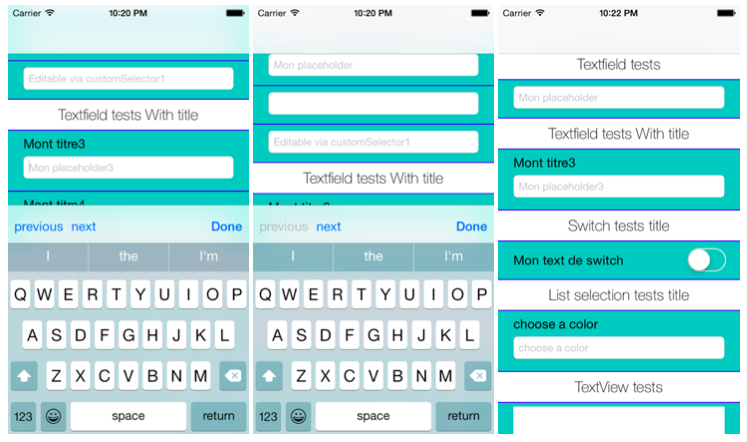

##JMFormDescription

JMFormDescription is an Objective-C library for easily creating forms on iOS. 



###Creating a form element (JMFormView)

To create a form object

```objc
    JMTextfieldFormViewDescription *textfieldDesc  = [JMTextfieldFormViewDescription new];
    textfieldDesc.placeholder = @"Mon placeholder";
    textfieldDesc.data = model.textfieldText1;
    textfieldDesc.formDelegate = self;
    textfieldDesc.modelKey = @"textfieldText1";
```

### Supported formViews

* JMFormSectionHeaderFormView (to simulate a section header),
* JMTextfieldFormView,
* JMTextfieldWithTitleFormView,
* JMSwitchFormView,
* JMButtonFormView,
* JMListFormView,
* JMTextViewFormView.

###Creating a form (JMFormScrollView)

Create a formDescription to describe all your formViews and call JMScrollView instance method 

```objc
- (void)reloadScrollViewWithFormDescription:(NSArray *)descriptions
```

### FormView actions, methods, updates
#### Delegation (JMFormDelegate)

```objc
- (void)textUpdatedFromFormView:(JMTextfieldFormView *)formView textfield:(UITextField *)textfield toText:(NSString *)text;
- (void)textUpdatedFromFormView:(JMTextViewFormView *)formView textView:(UITextView *)textView toText:(NSString *)text;
- (void)switchChangedFromFormView:(JMSwitchFormView *)formView toValue:(BOOL)value;
- (void)buttonPressedFromFormView:(JMButtonFormView *)formView withTitleValue:(NSString *)value;
- (void)listPressedFromFormView:(JMListFormView *)formView withSelectedValue:(NSString *)value;
- (void)selectedChoice:(NSString *)choice forModelKey:(NSString *)modelKey;
- (void)scrollToFormView:(JMFormView *)formView;
```

#### Blocks (JMFormViewCompltionBlock)

formDescription can contains your update methods !
```objc
JMTextfieldFormViewDescription *textfieldDesc = [JMTextfieldFormViewDescription new];
textfieldDesc.placeholder = @"Mon placeholder4";
textfieldDesc.data = model.maValeur;
textfieldDesc.completionBlock = ^(id modifiedValue){
     model.maValeur = modifiedValue;
};
```

### FormView UIAppearance

JMFormView can be customize using UIAppearance protocol.
```objc
[[JMFormView appearance] setFormViewBackgroundColor:[UIColor colorWithRed:219.0/255 green:214.0/255 blue:208/255 alpha:1.0]];
[[JMTextfieldFormView appearance] setFormViewTextfieldFont:[UIFont fontWithName:@"HelveticaNeue-Regular" size:16.0f]];
[[JMTextfieldFormView appearance] setFormViewTextfieldTextColor:[UIColor blackColor]];
    
[[JMTextfieldWithTitleFormView appearance] setFormViewTitleFont:[UIFont fontWithName:@"HelveticaNeue-Thin" size:16.0f]];
[[JMFormSectionHeaderFormView appearance] setFormViewHeaderLabelFont:[UIFont fontWithName:@"HelveticaNeue-Thin" size:25.0f]];
[[JMFormSectionHeaderFormView appearance] setFormViewHeaderBackgroundColor:[UIColor whiteColor]];
    
[[JMButtonFormView appearance] setFormViewButtonTitleColor:[UIColor whiteColor]];
[[JMButtonFormView appearance] setFormViewButtonBackgroundColor:[UIColor blackColor]];
[[JMButtonFormView appearance] setFormViewButtonTitleFont:[UIFont fontWithName:@"HelveticaNeue-Regular" size:16.0f]];
    
[[JMSwitchFormView appearance] setFormViewTitleFont:[UIFont fontWithName:@"HelveticaNeue-Thin" size:15.0f]];
[[JMSwitchFormView appearance] setFormViewSwitchTintColor:[UIColor purpleColor]];
```


### Todo
* Add PickerFormView, 
* Add DatePickerFormView,
* Keyboard type,
* Textfield Regex to validate input.


